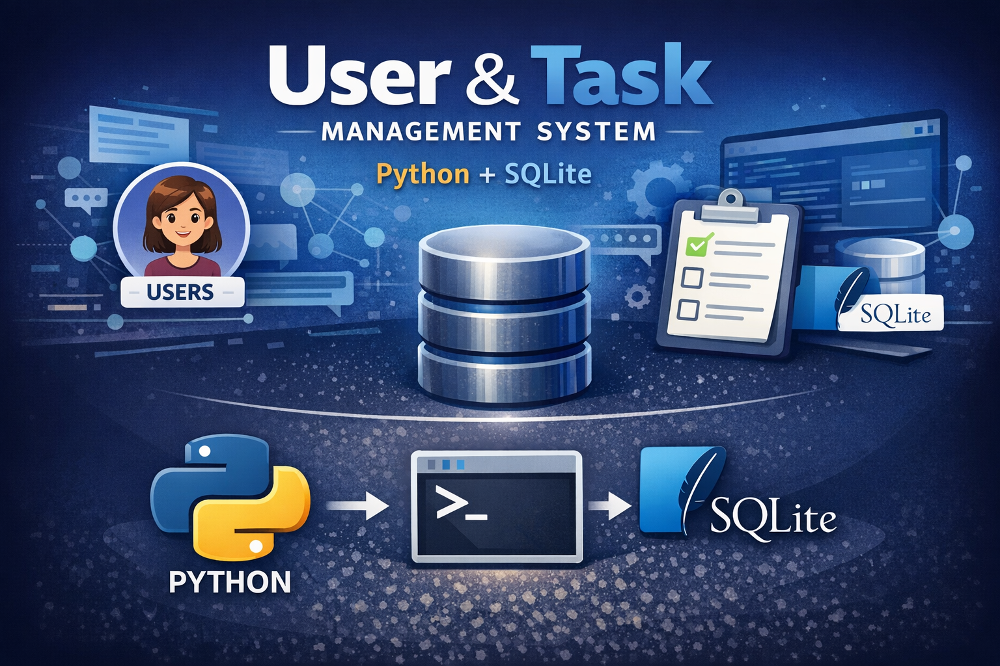

# 🗂️ User & Task Management System (Python + SQLite)

A simple **Command Line Interface (CLI)** application built with Python that allows users to register and manage their tasks using a local SQLite database.

This project demonstrates how Python can be used to build a **basic backend-like system** with persistent data storage.

---

# 🎯 Project Purpose

The goal of this project is to understand how Python can interact with a database and manage real-world data.

Through this project I practiced:

- Working with **SQLite databases**
- Creating and managing **tables**
- Performing **CRUD operations**
- Building a **modular Python application**
- Designing a simple **CLI-based system**

---

# 🧠 Features

✔ Create new users  
✔ Add tasks for users  
✔ View tasks stored in the database  
✔ Persistent data storage using SQLite  

---

# 🗄️ Database Structure

The application uses **SQLite** and creates two tables.

### users

| Column | Type |
|------|------|
| id | INTEGER PRIMARY KEY |
| username | TEXT |

### tasks

| Column | Type |
|------|------|
| id | INTEGER PRIMARY KEY |
| user_id | INTEGER |
| task_name | TEXT |

---

# 📂 Project Structure

project/
│
├── main.py
├── database.py
└── app.db

### main.py
Handles the **CLI interface and user interaction**.

### database.py
Contains all **database logic and functions**.

### app.db
SQLite database file where all data is stored.

---

# ⚙️ How to Run the Project

1. Clone the repository

git clone https://github.com/yourusername/project-name.git

2. Navigate to the project folder

cd project-name

3. Run the application

python main.py

---

# 🖥️ Example Usage

1 - Create User
2 - Add Task
3 - List Tasks
4 - Exit

Selection: 1
Username: jasmine
User created.

Selection: 2
Task: Study Python databases
Task added.

Selection: 3

Study Python databases

---

# 🚀 Possible Improvements

Future improvements could include:

- Task completion status
- Deleting tasks
- Multiple users with authentication
- Converting the project into a **web application**
- Adding a simple **API**

---

# 📘 What I Learned

This project helped me understand how Python can be used beyond scripts to build **real systems that store and manage data**.

It also introduced me to the basics of **database-driven application logic**, which is a fundamental concept in backend development and data engineering.

---

# 👩‍💻 Author

Built as part of the **Bootcamp w Gokce Cevik** by Ipek EGMEN
